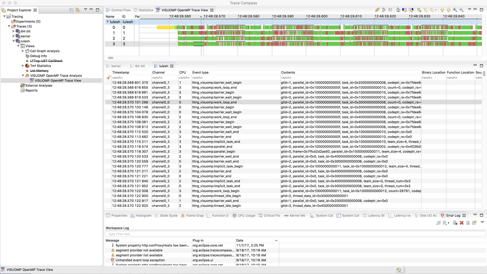

# OpenMP OMPT Event Tracing and Visualization

 * lttng tracing framework (http://lttng.org/) for tracing OpenMP runtime using lttng-ust library
 * eclipse-based tracecompass GUI (http://tracecompass.org/) for visualize the tracing results. 
 * It requires to use data-driven analysis of tracecompass to visualize the OpenMP tracing data (http://help.eclipse.org/).
 * Tracecompass developer and user guide (https://wiki.eclipse.org/Trace_Compass)
 * Research project from Polytechnique Montreal: http://hsdm.dorsal.polymtl.ca/
 
 ### Tracecompass development. Tracecompass is an Eclipse plugin and framework. Follow the steps from the wiki page for the development:
 * Set up Eclipse development environment
 * Clone tracecompass repo (https://git.eclipse.org/c/tracecompass/org.eclipse.tracecompass.git/about/)
 * Study the developer guide and browse source code for the development
 * Eclipse plugin tutorial (http://www.vogella.com/tutorials/EclipsePlugin/article.html)

 ### Screenshot
 #### Lulesh tracing and visualization with Tracecompass
 
 
